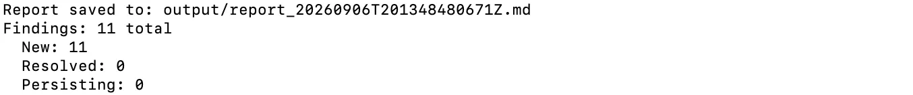
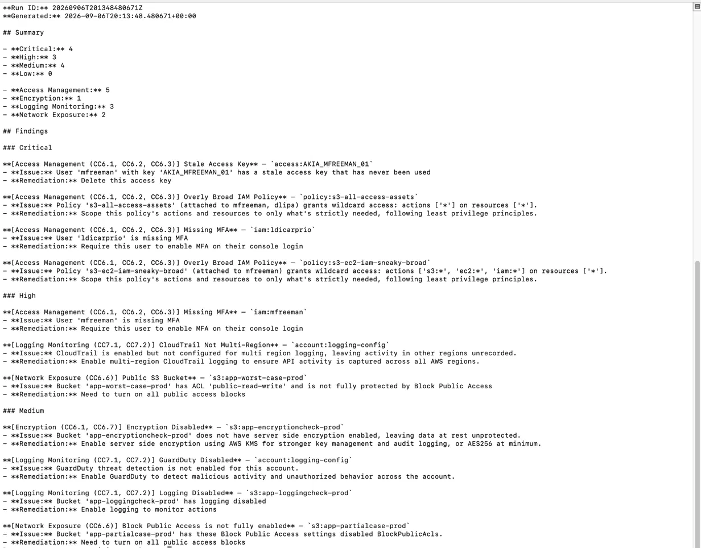
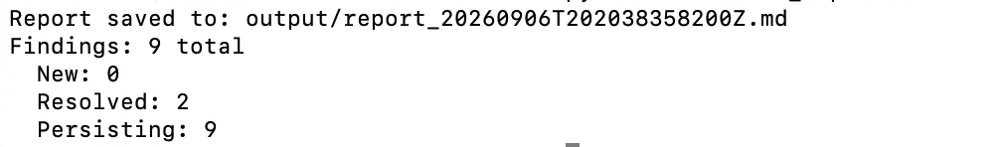

# Compliance/Control Audit Reporter
This is a python tool that scans a mock cloud environment (AWS) for common security misconfigurations to determine if the resources in the environment comply with the SOC2 framework. Misconfigurations are tied to Access Management, Encryption, Logging & Monitoring, and Network Exposure. This tool includes severity rating, remediation recommendation, and it also tracks state across runs. When an issue is fixed within the environemnt and a rescan is ran, the tool updates on whats new, resolved, and what is still open. This tool is meant to mirror how a real internal audit function on recurring control testing. 

## Why this maps to SOC2 / internal audit
SOC2 is the compliance framework that gives the findings a shared vocabulary with the users reading the report. SOC2 is one of the most common framework companies get audited against. Instead of just flagging an issues, the SOC2 justifies why the issue is a problem. It makes the report legible to auditors without extra explanation. SOC2 also served as a structuring tool for this project, defining the control categories and check types. 

| Category | Control Refs | Covers|
|---|---|---|
| Access Management | CC6.1, CC6.2, CC6.3 | authentication, least privilege, IAM policy scope |
| Encryption | CC6.1, CC6.7 | data at rest protection |
| Logging & Monitoring | CC7.1, CC7.2 | CloudTrail, GuardDuty, access logging |
| Network Exposure | CC6.6 | public S3 bucket, incomplete Block Public Access |

- CC6 - Who can access systems and how thats restricted
- CC7 - Detecting and responding to processing anomalies and security incidents

The control refs are meant to mirror the style of real SOC2 CC6/CC7 criteria, they are not pull from certified audit engagement or an offical AICPA mapping document

## What it checks
| Category | Example Findings |
|---|---|
| Public S3 Bucket | ACL is public or Block Public Access isn't fully enabled | 
| Missing MFA | console user with no MFA, escalated to critical severity if they're an admin | 
| Overly broad IAM policies | Action: "*" / Resource: "*", or multiple service:* wildcards against Resource: "*" | 
| Stale Access Key | active key never used or unused for more than 90 days | 
| Missing Encryption | S3 buckets without server-side encryption | 
| Missing logging | S3 access logging off or CloudTrail/Guarduty Disabled | 

## Project Layout
```
compliance-audit-reporter/
    audit_reporter/
        controls.py #SOC2 category + severity lookup
        scanner.py #one check function per finding type
        report.py #finding_id generation, report assembly, markdown rendering
        history.py #cross run state (new/resolved/persisting)
        cli.py #scan and history subcommand
        mock_data/ #the mock environment
            s3_buckets.json
            iam_users.json
            iam_policies.json
            access_keys.json
            logging_config.json
    output/ #generate reports
```

## Usage
```bash
python3 -m audit_reporter.cli scan
```
^Runs every check against the mock environment and writes a timestamped Markdown report to the output folder, updating state.json with whats currently open

```bash
python3 -m audit_reporter.cli history
```
^Shows every finding currently tracked in state.json, and how many days it's been open for


## Remediation Tracking
- Updated audit_reporter/mock_data/iam_users.json and set the mfa_enabled: true for user who had it disabled and reran scan


### First Scan: Run against the environment as is


### Generate Report


### After Remediation
After remediating two findings and rescanning, the tool correctly reported 9 findings, with 2 marked resolved and 0 falsely flagged as new. 
- Enabling MFA for one user
- Enabling encryption for one bucket



## Design Decisions:
- Inactive access keys are excluded from staleness checks since a deactivated key isn't a live risk regardless of age or usage history
- Private ACL buckets with any block public access disabled is still flagged with lower severity
- Skip non allow statements in overly broad policy check since modeling full IAM allow/deny evaluation was out of scope


